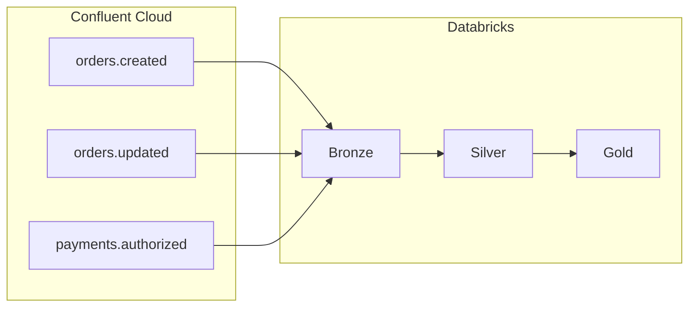

# From Kafka to the Lakehouse: Building a Medallion Pipeline with Confluent Cloud and Databricks

*A practical walkthrough of streaming orders and payments into Delta Live Tables—bronze, silver, gold—and shipping it all with Databricks Asset Bundles.*

---

## Why this project exists

Teams moving to a **lakehouse** still need a reliable way to land **real-time events**. **Apache Kafka** is the usual backbone; **Databricks** gives you governed tables, SQL, and ML on top of **Delta**. The gap is often glue code: authentication to a managed Kafka (here **Confluent Cloud**), a clear **medallion** layout, and a path to **deploy** the same pipeline across workspaces without copy-pasting notebooks.

This article accompanies an open reference implementation that wires those pieces together. The goal is not a toy “hello world,” but a pattern you can adapt: **multi-topic** consumption, **incremental** bronze ingestion, **typed** silver parsing, and **gold** aggregates your analysts can query.

---

## What we’re building

Picture three Kafka topics:

- `orders.created` — new orders with line items and totals  
- `orders.updated` — status changes  
- `payments.authorized` — payment confirmation tied to an order  

Events flow into **Delta Live Tables (DLT)** in **Unity Catalog**:

| Layer | Objects (examples) | Role |
|--------|---------------------|------|
| Bronze | `raw_kafka_orders` | Raw stream: key, value, topic, offset, timestamps |
| Silver | `silver_order_events` | Parsed JSON, one logical schema across event types |
| Gold | `gold_orders_by_region`, `gold_payments_by_method`, `gold_event_counts_by_type`; `gold_order_status_history` (via `v_order_status_updates`) | Aggregates plus **SCD Type 2** status history from `order.updated` |

A small **PySpark notebook** can simulate producers so you can test the pipeline without an external order system.

The name **“Lakeflow”** here is shorthand: **lake** (Delta as the system of record) plus **flow** (continuous or triggered processing over streams).

---

## Architecture at a glance



**Bronze** uses Spark’s Kafka source with **SASL_SSL** and **PLAIN** (API key and secret from Confluent), and subscribes to a **comma-separated** topic list—one reader, three topics. **Silver** uses a single **JSON schema** with optional fields so `order.created`, `order.updated`, and `payment.authorized` payloads all map cleanly. **Gold** combines aggregates (revenue by region, payments by method, event counts) with an **SCD Type 2** table for order status history driven by **`order.updated`** events.

---

## Stack and prerequisites

- **Confluent Cloud** cluster and API key with access to your topics  
- **Databricks** workspace with **Unity Catalog**, **DLT**, and permission to run **serverless** pipelines (as configured in the project)  
- **Databricks CLI** (≥ 0.279.0) — deploy with **`DATABRICKS_BUNDLE_ENGINE=direct`** and **`databricks bundle deploy`** (direct engine; **no** Terraform, **no** shell scripts in the repo)  
- Familiarity with **PySpark** and the **medallion** idea helps but isn’t mandatory  

Store **secrets** in **Databricks Secrets** or your CI secret store for anything beyond a personal sandbox—never treat API keys as permanent documentation.

---

## How the repository is organized

The project uses a **Databricks Asset Bundle**: `databricks.yml` points at your workspace and sync path; `resources/kafka_lakeflow_pipeline.yml` defines the **DLT pipeline** (catalog, schema, Photon/serverless, Kafka configuration, library glob). You deploy with the **CLI and environment variable only**—there are no `.sh` wrappers in the repository.

Python modules under `src/` run in order (`01` → `02` → `03`):

1. **Bronze** — `readStream` from Kafka, append flow into Delta  
2. **Silver** — `from_json` into a unified struct, expectations on core fields  
3. **Gold** — materialized views for regional revenue, payment mix, and event counts; **SCD Type 2** history for order status via `create_auto_cdc_flow`  

The simulator lives under `notebooks/` and writes to Kafka using the same bootstrap and SASL settings you pass through Spark configuration.

For **`databricks.yml`**, Kafka keys, and full metric-view instructions, see the project **`README.md`**.

---

## Unity Catalog metric views (why not plain views?)

**Gold tables** answer ad hoc questions; **metric views** add a **semantic layer** on top: YAML lists **dimensions** and **measures** so “total revenue” or “order count” are defined **once** and reused consistently. A **normal SQL view** is only a saved query—every report can aggregate differently unless you police it by hand.

This project includes **`sql/metric_views/create_gold_metric_views.sql`**. Objects are created with **`CREATE VIEW … WITH METRICS LANGUAGE YAML`** (spec **1.1**). Each definition uses **`source: >`** plus **`SELECT * FROM`** the underlying gold table in Unity Catalog (catalog and schema match the DLT pipeline target). **Asset Bundles do not deploy metric views**—run the script in a SQL warehouse or notebook **after** gold tables exist (**17.2+** for YAML 1.1).

| Metric view | Gold source | Role |
|-------------|-------------|------|
| `mv_gold_orders_by_region` | `gold_orders_by_region` | Region KPIs |
| `mv_gold_payments_by_method` | `gold_payments_by_method` | Payments by method |
| `mv_gold_event_counts_by_type` | `gold_event_counts_by_type` | Event-type volumes |
| `mv_gold_order_status_current` | `gold_order_status_history` | **Current** status only (`__END_AT IS NULL`) |
| `mv_gold_order_status_history` | `gold_order_status_history` | **Full** SCD2 history + `is_current` |

**Downstream:** Use metric views as **datasets** in [Databricks AI/BI dashboards](https://docs.databricks.com/aws/en/dashboards/manage/data-modeling/datasets#use-metric-views) (add data source or SQL with [`MEASURE()`](https://docs.databricks.com/aws/en/sql/language-manual/functions/measure)), or connect [Power BI](https://docs.databricks.com/aws/en/partners/bi/power-bi-metric-views) with **DirectQuery** and **Metric View BI Compatibility Mode**. That keeps KPIs aligned between the lakehouse and reports.

Further reading: [Unity Catalog metric views](https://docs.databricks.com/aws/en/metric-views/) · [Create with SQL](https://docs.databricks.com/aws/en/metric-views/create/sql)

---

## Deployment in one minute

After configuring your workspace profile and `root_path` in `databricks.yml`, run **from the repository root** (replace `dev` with your target if needed):

**Routine deploy**

```bash
databricks bundle validate -t dev
DATABRICKS_BUNDLE_ENGINE=direct databricks bundle deploy -t dev
databricks bundle summary -t dev
```

**Optional dry run:** `DATABRICKS_BUNDLE_ENGINE=direct databricks bundle plan -t dev`

**If local bundle cache causes errors** (for example engine vs. state mismatch), clear the target’s local folder and deploy again **in order**:

```bash
rm -rf .databricks/bundle/dev
DATABRICKS_BUNDLE_ENGINE=direct databricks bundle deploy -t dev
databricks bundle summary -t dev
```

On Windows, delete `.databricks\bundle\dev` instead of `rm -rf`. The `.databricks/` tree is gitignored and is not part of the repo.

That syncs sources and updates the pipeline definition. Run the pipeline from the Databricks UI, or trigger it on a schedule once you’re happy with cost and latency.

---

## Lessons worth taking away

1. **Multi-topic subscribe** keeps operational overhead low—one checkpointed stream, topic preserved in the bronze table for lineage.  
2. **One silver schema with optional fields** often beats three separate streams when event volumes are moderate and schemas are related.  
3. **Bundles** plus **`DATABRICKS_BUNDLE_ENGINE=direct`** give you repeatable deploys from YAML without Terraform or custom shell scripts.  
4. **Simulators** that mirror production JSON save hours when Kafka ACLs and producers are owned by another team.  
5. **SCD Type 2** on status updates turns a stream of `order.updated` events into queryable history in the gold layer.  
6. **Metric views** on gold give you a governed **semantic layer** (dimensions/measures) for dashboards and Power BI—distinct from a plain SQL view, which does not encode those rules.  

---

## Closing

Streaming from Kafka into governed Delta tables is a standard pattern; the details—auth, topic lists, DLT expectations, Unity Catalog targets—are where projects succeed or stall. This reference ties them together so you can focus on **business logic** in silver and gold, then optionally **publish the same KPIs** through **metric views** to dashboards and BI without redefining metrics in every tool.

**Repository:** [github.com/bijuthottathil/KAFKA-LAKEFLOW](https://github.com/bijuthottathil/KAFKA-LAKEFLOW)

---

## Notes for publishing on Medium

- Medium does not render **Mermaid** in all contexts; export the diagram as a PNG from [Mermaid Live](https://mermaid.live) or duplicate the flow in a simple bullet list for the imported post.  
- Paste code blocks with **fixed-width font** and keep lines short for mobile readers.  
- Add a **featured image** (architecture sketch or Confluent + Databricks logos per each vendor’s brand guidelines).  
- Replace or remove the GitHub URL if you mirror the repo elsewhere.  
- Consider a **TL;DR** bullet list at the top for scroll-heavy readers.
