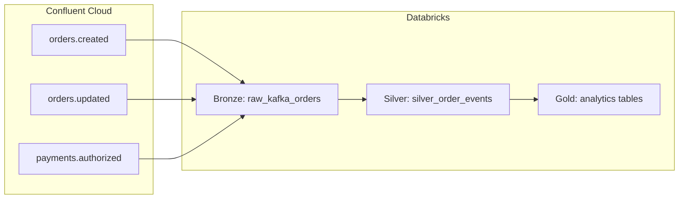

# Kafka Lakeflow (Databricks)

This project demonstrates an end-to-end **streaming analytics** pattern on **Databricks**: **Apache Kafka** (Confluent Cloud) as the event bus, **Delta Live Tables (DLT)** for medallion-style pipelines in **Unity Catalog**, and an optional **notebook simulator** that publishes realistic order and payment events for development and testing.

The name “Lakeflow” reflects the combination of **data lake** storage (Delta) and **continuous** or **triggered** pipeline processing over streaming inputs.

---

## Intent

- Show how to **ingest multi-topic Kafka streams** into the lakehouse with correct **SASL_SSL / PLAIN** authentication against Confluent Cloud.
- Model **bronze → silver → gold** layers so raw messages stay auditable, parsed events are clean and typed, and **aggregated tables** support analytics and monitoring.
- Provide a **repeatable bundle** (`databricks.yml` + resources) so the same code and configuration can be **deployed** with the **Databricks CLI** only—set **`DATABRICKS_BUNDLE_ENGINE=direct`** (no shell wrappers, no Terraform).
- Enable **local-like testing** by generating JSON events (orders created/updated, payments authorized) that match the schemas expected downstream.

---

## Architecture



1. **Bronze (`raw_kafka_orders`)**  
   Incremental **append flow** from Kafka. Stores the Kafka envelope: message key/value, topic, partition, offset, timestamps. Offsets are checkpointed so each pipeline run processes **new data only** (with `startingOffsets` set for first-time behavior as configured in code).

2. **Silver (`silver_order_events`)**  
   Parses **JSON** payloads into a unified schema covering:
   - `order.created` — customer, region, line items, `total_amount`
   - `order.updated` — `new_status`
   - `payment.authorized` — `payment_id`, `amount`, `method`  
   Quality rules drop rows that fail basic expectations (e.g. missing `event_type` / `event_time`).

3. **Gold**  
   **Materialized views:** `gold_orders_by_region`, `gold_payments_by_method`, `gold_event_counts_by_type` (aggregates from silver). **SCD Type 2:** `gold_order_status_history` holds the full history of **`order.updated`** status changes via `create_auto_cdc_flow`, with an intermediate streaming view `v_order_status_updates`.

---

## Repository layout

| Path | Purpose |
|------|---------|
| `databricks.yml` | Databricks Asset Bundle definition (workspace host, profile, `root_path`, targets). Deploy commands are documented below—there are **no** `.sh` helpers in this repo. |
| `resources/kafka_lakeflow_pipeline.yml` | DLT pipeline: UC catalog/schema, serverless/Photon, `libraries` glob, **Kafka and simulation** configuration. |
| `src/01.kafka-bronze.py` | Bronze streaming ingestion from Kafka. |
| `src/02.kafka-silver.py` | Silver parsing and cleansing. |
| `src/03.kafka-gold.py` | Gold aggregations and latest-status logic. |
| `notebooks/simulator_kafka_events.py` | Notebook: generates sample events and writes to the three Kafka topics via Spark’s Kafka writer. |
| `sql/metric_views/create_gold_metric_views.sql` | **`CREATE VIEW … WITH METRICS`** DDL for Unity Catalog **metric views** on gold tables (run manually or via a SQL job after gold exists). |

Pipeline notebooks are executed in **lexical order** by filename prefix (`01`, `02`, `03`).

---

## Customizing `databricks.yml` for your environment

The bundle file `databricks.yml` tells the Databricks CLI **which workspace to use**, **how to authenticate**, and **where uploaded files land**. Replace the sample values with your own before sharing the repo or deploying as a team.

| Setting | What to change |
|--------|----------------|
| `bundle.name` | Logical name for this bundle (shown in CLI output). Use something unique if you run many projects, e.g. `kafka-lakeflow-acme`. |
| Deploy | Set **`DATABRICKS_BUNDLE_ENGINE=direct`** and run **`databricks bundle deploy`** (commands are in **Deploying to Databricks** below). See [Direct deployment](https://docs.databricks.com/aws/en/dev-tools/bundles/direct). |
| `workspace.host` | Your workspace URL (Azure, AWS, or GCP). Copy it from the browser when you are logged into Databricks (must match the workspace you intend to deploy to). |
| `workspace.profile` | Name of a profile in `~/.databrickscfg` (or your platform’s credential store). The CLI uses this profile for `bundle deploy`, `bundle summary`, etc. Create or pick a profile with [`databricks auth login`](https://docs.databricks.com/dev-tools/cli/authentication.html) for that host. |
| `workspace.root_path` | **Workspace folder** where bundle files are synced (under `/Workspace/Users/<user>/...` when you use `~`). Choose a path you own and that matches your team’s naming convention. This path appears in the pipeline’s `libraries` include via `${workspace.file_path}` in `resources/kafka_lakeflow_pipeline.yml`. |
| `include` | Lists bundle resource YAML files. Keep `resources/*.yml` unless you split pipelines into more files. |
| `targets` | **dev** vs **prod** (or add more). Set `default: true` on the target you use most often (`databricks bundle deploy -t dev`). |
| `targets.<name>.mode` | `development` enables dev-oriented behavior (e.g. shorter names in some setups); `production` for prod-like deploys. |
| `targets.<name>.workspace` | Optional **per-target overrides** for `host`, `profile`, or `root_path`. The `prod` target in this repo only overrides `root_path`; add `host` / `profile` here if prod uses a different workspace or folder. |

**Suggested workflow**

1. Copy `databricks.yml` and edit the table fields above for your user or team.
2. Run `databricks bundle validate -t <target>` to catch syntax and resolution errors.
3. Run `databricks bundle summary -t <target>` and confirm **Host**, **User**, and **Path** match expectations.
4. Deploy with `DATABRICKS_BUNDLE_ENGINE=direct databricks bundle deploy -t <target>` (see **Deploying to Databricks**).

**Note:** Pipeline-specific settings (Kafka, Unity Catalog catalog/schema, serverless) live in `resources/kafka_lakeflow_pipeline.yml`, not in `databricks.yml`. See the next section for Kafka configuration.

---

## Kafka topics and configuration

The pipeline **subscribes** to a comma-separated list (Spark `subscribe` option):

- `orders.created`
- `orders.updated`
- `payments.authorized`

Connection settings are passed as **pipeline configuration** keys consumed in PySpark via `spark.conf.get(...)`:

- `kafka.bootstrap.servers`
- `kafka.api.key` / `kafka.api.secret` (SASL PLAIN)
- `kafka.topic` (comma-separated topic list)
- `simulation.num_events` (default batch size hint for the simulator notebook; typically `"50"`)

**Security note:** For anything beyond a personal sandbox, store API credentials in **Databricks secrets** (or a secret-backed configuration) and reference them from pipeline configuration instead of committing plain text.

---

## Unity Catalog

The pipeline resource declares a target **catalog** and **schema** for managed tables (see `resources/kafka_lakeflow_pipeline.yml`). Adjust `catalog` / `schema` to match your organization’s naming and permissions.

### Metric views on gold tables

[Unity Catalog metric views](https://docs.databricks.com/aws/en/metric-views/) are **views with a semantic contract**: YAML defines **dimensions** (how you slice and filter) and **measures** (how you aggregate), so KPIs stay **consistent** across SQL, dashboards, and BI tools. A **normal SQL view** is only a saved query—everyone can aggregate differently unless you document conventions yourself.

**Why use metric views here?** The gold tables already hold aggregates and SCD2 history; metric views expose them as **named dimensions and measures** for [AI/BI dashboards](https://docs.databricks.com/aws/en/dashboards/manage/data-modeling/datasets) and [Power BI](https://docs.databricks.com/aws/en/partners/bi/power-bi-metric-views) without redefining “revenue” or “order count” in each tool.

**This repo** ships **`sql/metric_views/create_gold_metric_views.sql`**. Each statement:

- Uses **`CREATE OR REPLACE VIEW`** with a backtick-qualified catalog in SQL (see file; example target: `na-dbxtraining.biju_lakeflowschema.mv_gold_orders_by_region`).
- Uses **`WITH METRICS`** / **`LANGUAGE YAML`** with **`version: 1.1`**.
- Sets **`source: >`** to **`SELECT * FROM`** the matching gold table, fully qualified with the same catalog and schema (same pattern for every gold source).

| Metric view | Gold source | Purpose |
|-------------|-------------|---------|
| `mv_gold_orders_by_region` | `gold_orders_by_region` | Dimensions: `region`. Measures: `order_count`, `total_revenue`. |
| `mv_gold_payments_by_method` | `gold_payments_by_method` | Dimensions: `payment_method`. Measures: `payment_count`, `total_amount`. |
| `mv_gold_event_counts_by_type` | `gold_event_counts_by_type` | Dimensions: `event_type`. Measures: `event_count`. |
| `mv_gold_order_status_current` | `gold_order_status_history` | **Filter** `__END_AT IS NULL` (active SCD2 rows). Dimensions: `order_id`, `new_status`, `status_effective_time`. Measure: `orders` (distinct orders). |
| `mv_gold_order_status_history` | `gold_order_status_history` | Full history. Dimensions include **`is_current`** (`__END_AT IS NULL`). Measure: `status_versions`. |

**Deploy:** Metric views are **not** a [bundle resource](https://docs.databricks.com/aws/en/dev-tools/bundles/resources)—run the SQL after gold exists. Use a **SQL warehouse** (or notebook) on **DBR / warehouse 17.2+** (YAML **1.1**). Replace **`na-dbxtraining`** / **`biju_lakeflowschema`** in the file if yours differ. If SCD2 column names differ, **`DESCRIBE TABLE gold_order_status_history`** and adjust **`__START_AT` / `__END_AT`** in the YAML.

**Consume:**

- **Databricks dashboards** — Add a dataset from **Data** → **Add data source** and pick the metric view, or use **Create from SQL** with the [`MEASURE()`](https://docs.databricks.com/aws/en/sql/language-manual/functions/measure) function for measures. See [Use metric views in dashboards](https://docs.databricks.com/aws/en/dashboards/manage/data-modeling/datasets#use-metric-views).
- **Power BI** — Connect with **DirectQuery**, enable **Metric View BI Compatibility Mode**, use **ADBC** (default for new connections). See [Query metric views in Power BI](https://docs.databricks.com/aws/en/partners/bi/power-bi-metric-views).

**Create / reference:** [Create metric views with SQL](https://docs.databricks.com/aws/en/metric-views/create/sql) · [Metric views overview](https://docs.databricks.com/aws/en/metric-views/)

---

## Simulator notebook

`notebooks/simulator_kafka_events.py` mirrors the event generator logic (customers, products, regions, weighted random event types). It:

- Respects `simulation.num_events` from Spark configuration when present.
- Produces keyed JSON messages and writes them to Kafka using the **same bootstrap and SASL settings** as the pipeline (you must provide `kafka.*` on the cluster or session running the notebook).

Run the simulator **before** or **between** pipeline runs if you need fresh data in the topics.

---

## Deploying to Databricks

Prerequisites:

- [Databricks CLI](https://docs.databricks.com/dev-tools/cli/index.html) **0.279.0 or newer** (supports the **direct** deployment engine).
- CLI authenticated (this project uses a **profile**, e.g. `biju`, in `databricks.yml`).
- Permissions to deploy bundles and update pipelines in the target workspace.

### Deployment (direct engine, CLI only)

Deploys use the **direct** engine ([docs](https://docs.databricks.com/aws/en/dev-tools/bundles/direct)): the CLI talks to Databricks APIs directly (**no** Terraform, **no** wrapper scripts in this repository). Local deployment metadata lives under **`.databricks/bundle/<target>/`** (including **`resources.json`**). That folder is listed in **`.gitignore`** and is not committed.

Run everything **from the project root** (the folder that contains `databricks.yml`). Replace `dev` with another target name if you use `prod`, etc.

Set **`DATABRICKS_BUNDLE_ENGINE=direct`** on each `bundle deploy` / `bundle plan` (prefix on the same line, or `export` once per shell). In **CI/CD**, set the same variable in the job environment (for example `DATABRICKS_BUNDLE_ENGINE: direct` in GitHub Actions).

**1. Routine deploy (validate → deploy → summary)**

```bash
databricks bundle validate -t dev
DATABRICKS_BUNDLE_ENGINE=direct databricks bundle deploy -t dev
databricks bundle summary -t dev
```

**Dry run (plan only):**

```bash
DATABRICKS_BUNDLE_ENGINE=direct databricks bundle plan -t dev
```

**2. Clear local bundle cache, then deploy** (use when you see errors such as *Required engine "direct" does not match present state files* — run **in this order** from the project root):

```bash
rm -rf .databricks/bundle/dev
DATABRICKS_BUNDLE_ENGINE=direct databricks bundle deploy -t dev
databricks bundle summary -t dev
```

On Windows, delete the folder `.databricks\bundle\dev` in Explorer or use your shell’s equivalent instead of `rm -rf`.

---

## Operational tips

- **Continuous vs triggered:** The pipeline resource sets `continuous: false` by default; switch to `true` if you want always-on streaming execution (consider cost and SLAs).
- **Reset behavior:** Bronze is configured to discourage full resets that would replay all of Kafka history; coordinate with your retention and checkpoint strategy before forcing resets.
- **Schema evolution:** If producers add fields, extend `ORDER_EVENT_SCHEMA` in silver and adjust gold logic as needed.
- **Order status history:** `gold_order_status_history` is populated by DLT **SCD Type 2** from `order.updated` events; see `src/03.kafka-gold.py` for `create_auto_cdc_flow` and sequencing by `(event_time, offset)`.

---

## Summary

This repo is a **reference implementation** for **Kafka → Delta Live Tables → Unity Catalog** with **order and payment** style events, a **multi-topic** Kafka subscription, **gold-layer SCD Type 2** for status history, optional **Unity Catalog metric views** on gold for dashboards and BI, and **CLI-based** bundle deployment with the **direct** engine (`DATABRICKS_BUNDLE_ENGINE=direct`).
