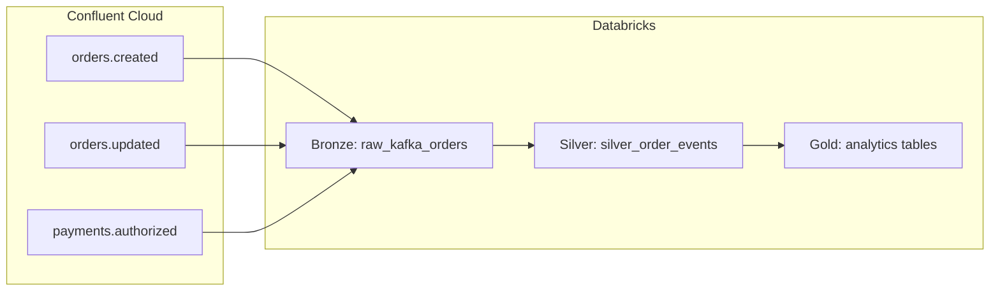

# Kafka Lakeflow (Databricks)

This project demonstrates an end-to-end **streaming analytics** pattern on **Databricks**: **Apache Kafka** (Confluent Cloud) as the event bus, **Delta Live Tables (DLT)** for medallion-style pipelines in **Unity Catalog**, and an optional **notebook simulator** that publishes realistic order and payment events for development and testing.

The name “Lakeflow” reflects the combination of **data lake** storage (Delta) and **continuous** or **triggered** pipeline processing over streaming inputs.

---

## Intent

- Show how to **ingest multi-topic Kafka streams** into the lakehouse with correct **SASL_SSL / PLAIN** authentication against Confluent Cloud.
- Model **bronze → silver → gold** layers so raw messages stay auditable, parsed events are clean and typed, and **aggregated tables** support analytics and monitoring.
- Provide a **repeatable bundle** (`databricks.yml` + resources) so the same code and configuration can be **deployed** to a Databricks workspace and run as a managed pipeline.
- Enable **local-like testing** by generating JSON events (orders created/updated, payments authorized) that match the schemas expected downstream.

---

## Architecture



1. **Bronze (`raw_kafka_orders`)**  
   Incremental **append flow** from Kafka. Stores the Kafka envelope: message key/value, topic, partition, offset, timestamps. Offsets are checkpointed so each pipeline run processes **new data only** (with `startingOffsets` set for first-time behavior as configured in code).

2. **Silver (`silver_order_events`)**  
   Parses **JSON** payloads into a unified schema covering:
   - `order.created` — customer, region, line items, `total_amount`
   - `order.updated` — `new_status`
   - `payment.authorized` — `payment_id`, `amount`, `method`  
   Quality rules drop rows that fail basic expectations (e.g. missing `event_type` / `event_time`).

3. **Gold (materialized views)**  
   Examples include revenue and order counts **by region**, payment totals **by method**, **event counts by type**, and **latest status per order** from update events. These are recomputed from silver on each pipeline run (materialized view semantics as defined in DLT).

---

## Repository layout

| Path | Purpose |
|------|---------|
| `databricks.yml` | Databricks Asset Bundle definition (workspace host, profile, `root_path`, targets). |
| `resources/kafka_lakeflow_pipeline.yml` | DLT pipeline: UC catalog/schema, serverless/Photon, `libraries` glob, **Kafka and simulation** configuration. |
| `src/01.kafka-bronze.py` | Bronze streaming ingestion from Kafka. |
| `src/02.kafka-silver.py` | Silver parsing and cleansing. |
| `src/03.kafka-gold.py` | Gold aggregations and latest-status logic. |
| `notebooks/simulator_kafka_events.py` | Notebook: generates sample events and writes to the three Kafka topics via Spark’s Kafka writer. |

Pipeline notebooks are executed in **lexical order** by filename prefix (`01`, `02`, `03`).

---

## Customizing `databricks.yml` for your environment

The bundle file `databricks.yml` tells the Databricks CLI **which workspace to use**, **how to authenticate**, and **where uploaded files land**. Replace the sample values with your own before sharing the repo or deploying as a team.

| Setting | What to change |
|--------|----------------|
| `bundle.name` | Logical name for this bundle (shown in CLI output). Use something unique if you run many projects, e.g. `kafka-lakeflow-acme`. |
| `workspace.host` | Your workspace URL (Azure, AWS, or GCP). Copy it from the browser when you are logged into Databricks (must match the workspace you intend to deploy to). |
| `workspace.profile` | Name of a profile in `~/.databrickscfg` (or your platform’s credential store). The CLI uses this profile for `bundle deploy`, `bundle summary`, etc. Create or pick a profile with [`databricks auth login`](https://docs.databricks.com/dev-tools/cli/authentication.html) for that host. |
| `workspace.root_path` | **Workspace folder** where bundle files are synced (under `/Workspace/Users/<user>/...` when you use `~`). Choose a path you own and that matches your team’s naming convention. This path appears in the pipeline’s `libraries` include via `${workspace.file_path}` in `resources/kafka_lakeflow_pipeline.yml`. |
| `include` | Lists bundle resource YAML files. Keep `resources/*.yml` unless you split pipelines into more files. |
| `targets` | **dev** vs **prod** (or add more). Set `default: true` on the target you use most often (`databricks bundle deploy -t dev`). |
| `targets.<name>.mode` | `development` enables dev-oriented behavior (e.g. shorter names in some setups); `production` for prod-like deploys. |
| `targets.<name>.workspace` | Optional **per-target overrides** for `host`, `profile`, or `root_path`. The `prod` target in this repo only overrides `root_path`; add `host` / `profile` here if prod uses a different workspace or folder. |

**Suggested workflow**

1. Copy `databricks.yml` and edit the table fields above for your user or team.
2. Run `databricks bundle validate -t <target>` to catch syntax and resolution errors.
3. Run `databricks bundle summary -t <target>` and confirm **Host**, **User**, and **Path** match expectations.
4. Deploy with `databricks bundle deploy -t <target>`.

**Note:** Pipeline-specific settings (Kafka, Unity Catalog catalog/schema, serverless) live in `resources/kafka_lakeflow_pipeline.yml`, not in `databricks.yml`. See the next section for Kafka configuration.

---

## Kafka topics and configuration

The pipeline **subscribes** to a comma-separated list (Spark `subscribe` option):

- `orders.created`
- `orders.updated`
- `payments.authorized`

Connection settings are passed as **pipeline configuration** keys consumed in PySpark via `spark.conf.get(...)`:

- `kafka.bootstrap.servers`
- `kafka.api.key` / `kafka.api.secret` (SASL PLAIN)
- `kafka.topic` (comma-separated topic list)
- `simulation.num_events` (default batch size hint for the simulator notebook; typically `"50"`)

**Security note:** For anything beyond a personal sandbox, store API credentials in **Databricks secrets** (or a secret-backed configuration) and reference them from pipeline configuration instead of committing plain text.

---

## Unity Catalog

The pipeline resource declares a target **catalog** and **schema** for managed tables (see `resources/kafka_lakeflow_pipeline.yml`). Adjust `catalog` / `schema` to match your organization’s naming and permissions.

---

## Simulator notebook

`notebooks/simulator_kafka_events.py` mirrors the event generator logic (customers, products, regions, weighted random event types). It:

- Respects `simulation.num_events` from Spark configuration when present.
- Produces keyed JSON messages and writes them to Kafka using the **same bootstrap and SASL settings** as the pipeline (you must provide `kafka.*` on the cluster or session running the notebook).

Run the simulator **before** or **between** pipeline runs if you need fresh data in the topics.

---

## Deploying to Databricks

Prerequisites:

- [Databricks CLI](https://docs.databricks.com/dev-tools/cli/index.html) installed and authenticated (this project uses a CLI **profile**, e.g. `biju`, in `databricks.yml`).
- Permissions to deploy bundles and update pipelines in the target workspace.

From the project root:

```bash
databricks bundle deploy -t dev
```

This uploads bundle files under the workspace path derived from `root_path` in `databricks.yml` (for example `training/v2-training/kafka-lakeflow/files`) and applies pipeline resource updates.

Use `databricks bundle summary -t dev` to confirm the target workspace, user, and pipeline URL.

---

## Operational tips

- **Continuous vs triggered:** The pipeline resource sets `continuous: false` by default; switch to `true` if you want always-on streaming execution (consider cost and SLAs).
- **Reset behavior:** Bronze is configured to discourage full resets that would replay all of Kafka history; coordinate with your retention and checkpoint strategy before forcing resets.
- **Schema evolution:** If producers add fields, extend `ORDER_EVENT_SCHEMA` in silver and adjust gold logic as needed.

---

## Summary

This repo is a **reference implementation** for **Kafka → Delta Live Tables → Unity Catalog** with **order and payment** style events, a **multi-topic** Kafka subscription, and a **bundled** deployment story suitable for training, demos, or as a starting point for production-hardening (secrets, monitoring, and SLAs).
